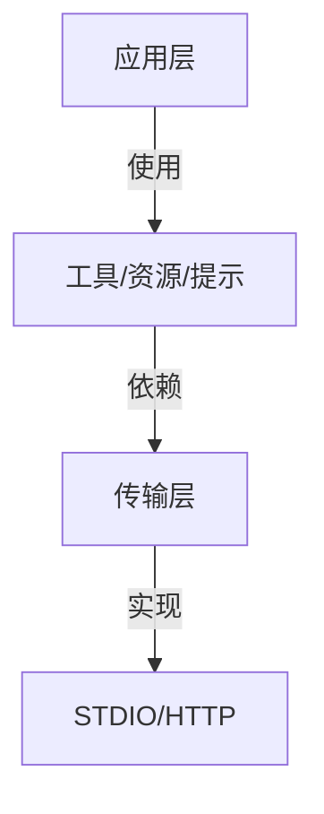

# 📚 TypeScript MCP开发从入门到精通

## 前言
本教程专为前端开发者设计，从零开始学习如何使用TypeScript开发MCP服务器。即使没有MCP经验，也能通过本教程快速上手。

## MCP协议架构详解

### 协议分层


### 核心概念
1. **Server**：MCP服务器实例，管理连接和路由
2. **Transport**：通信传输层，支持STDIO和HTTP
3. **Tools**：可执行的操作，类似API端点
4. **Resources**：只读数据源，类似GET请求
5. **Prompts**：交互模板，指导LLM行为

## 开发环境准备

### 完整依赖配置
```bash
# 使用pnpm（推荐）
pnpm init
pnpm add @modelcontextprotocol/sdk zod express cors
pnpm add -D typescript @types/node @types/express @types/cors
```

### 进阶TypeScript配置
```json
{
  "compilerOptions": {
    "target": "ES2022",
    "module": "NodeNext",
    "moduleResolution": "NodeNext",
    "outDir": "dist",
    "rootDir": "src",
    "strict": true,
    "esModuleInterop": true,
    "skipLibCheck": true,
    "forceConsistentCasingInFileNames": true,
    "types": ["node"]
  },
  "include": ["src"],
  "exclude": ["node_modules"]
}
```

## 第一个MCP服务器

### 完整示例
```typescript
import { McpServer } from "@modelcontextprotocol/sdk/server/mcp";
import { StdioServerTransport, StreamableHTTPServerTransport } from "@modelcontextprotocol/sdk/server";
import { z } from "zod";
import express from "express";

// 1. 创建服务器
const server = new McpServer({
  name: "my-mcp-server",
  version: "1.0.0",
  capabilities: {
    tools: true,
    resources: true,
    prompts: true
  }
});

// 2. 注册组件
server.registerTool("greet", {
  description: "打招呼工具",
  inputSchema: z.object({
    name: z.string().describe("用户名")
  })
}, async ({ name }) => ({
  content: [{ type: "text", text: `你好, ${name}!` }]
}));

// 3. 选择传输模式
const transportType = process.env.TRANSPORT || "stdio";

if (transportType === "http") {
  // HTTP模式
  const app = express();
  app.use(express.json());
  
  const transport = new StreamableHTTPServerTransport({
    sessionIdGenerator: () => crypto.randomUUID()
  });
  
  app.post("/mcp", async (req, res) => {
    await transport.handleRequest(req, res, req.body);
  });
  
  app.listen(3000, () => {
    console.log("HTTP服务器已启动");
  });
} else {
  // STDIO模式
  const transport = new StdioServerTransport();
  server.connect(transport);
}
```

## 核心组件开发

### 工具(Tools)开发

#### 完整参数配置
```typescript
server.registerTool("advanced-calc", {
  title: "高级计算器",
  description: "支持多种数学运算",
  inputSchema: z.object({
    operation: z.enum(["add", "subtract", "multiply", "divide"]),
    numbers: z.array(z.number()).min(2)
  }),
  annotations: {
    category: "math",
    complexity: "high"
  }
}, async ({ operation, numbers }) => {
  let result: number;
  switch (operation) {
    case "add": 
      result = numbers.reduce((a, b) => a + b);
      break;
    // 其他运算...
  }
  
  return {
    content: [{ type: "text", text: `结果: ${result}` }],
    metadata: {
      calculationSteps: numbers.join(` ${operation} `)
    }
  };
});
```

### 资源(Resources)开发

#### 动态资源模板
```typescript
server.registerResource(
  "user-data",
  new ResourceTemplate("user://{id}/data/{field}", {
    list: {
      // 可列出所有用户
      parameters: ["id"],
      resolver: async () => ["user1", "user2"]
    },
    complete: {
      // 字段自动补全
      field: (value, ctx) => ["name", "email", "age"].filter(f => f.startsWith(value))
    }
  }),
  {
    title: "用户数据",
    description: "动态用户数据资源"
  },
  async (uri, { id, field }) => {
    const data = await getUserData(id, field);
    return {
      contents: [{
        uri: uri.href,
        text: JSON.stringify(data)
      }]
    };
  }
);
```

### 提示(Prompts)开发

#### 上下文感知提示
```typescript
server.registerPrompt(
  "context-aware-chat",
  {
    title: "上下文聊天",
    description: "保持对话上下文的聊天提示",
    argsSchema: z.object({
      message: z.string(),
      history: z.array(z.object({
        role: z.enum(["user", "assistant"]),
        content: z.string()
      })).optional()
    })
  },
  ({ message, history = [] }) => ({
    messages: [
      ...history,
      {
        role: "user" as const,
        content: {
          type: "text",
          text: message
        }
      }
    ]
  })
);
```

## 传输模式详解

### STDIO模式 vs HTTP模式对比

| 特性                | STDIO模式          | HTTP模式            |
|---------------------|-------------------|---------------------|
| 适用场景            | 命令行工具/本地集成 | Web应用/远程访问     |
| 性能                | 更高               | 稍低                |
| 会话管理            | 简单               | 复杂(需session ID)   |
| 浏览器支持          | 不支持             | 支持                |
| 部署复杂度          | 简单               | 中等                |

### HTTP模式安全配置
```typescript
const transport = new StreamableHTTPServerTransport({
  sessionIdGenerator: () => crypto.randomUUID(),
  enableDnsRebindingProtection: true,
  allowedHosts: ['127.0.0.1', 'localhost'],
  allowedOrigins: ['https://yourdomain.com'],
  maxSessions: 100, // 限制并发会话数
  sessionTimeout: 30 * 60 * 1000 // 30分钟超时
});
```

## 参考资料
```ts
async function main() {
  const transportType = TRANSPORT_TYPE;

  if (transportType === "http" || transportType === "sse") {
    // Get initial port from environment or use default
    const initialPort = CLI_PORT ?? 3000;
    // Keep track of which port we end up using
    let actualPort = initialPort;
    const httpServer = createServer(async (req, res) => {
      const url = new URL(req.url || "", `http://${req.headers.host}`).pathname;

      // Set CORS headers for all responses
      res.setHeader("Access-Control-Allow-Origin", "*");
      res.setHeader("Access-Control-Allow-Methods", "GET,POST,OPTIONS,DELETE");
      res.setHeader(
        "Access-Control-Allow-Headers",
        "Content-Type, MCP-Session-Id, mcp-session-id, MCP-Protocol-Version"
      );
      res.setHeader("Access-Control-Expose-Headers", "MCP-Session-Id");

      // Handle preflight OPTIONS requests
      if (req.method === "OPTIONS") {
        res.writeHead(200);
        res.end();
        return;
      }

      try {
        // Extract client IP address using socket remote address (most reliable)
        const clientIp = getClientIp(req);

        // Create new server instance for each request
        const requestServer = createServerInstance(clientIp);

        if (url === "/mcp") {
          const transport = new StreamableHTTPServerTransport({
            sessionIdGenerator: undefined,
          });
          await requestServer.connect(transport);
          await transport.handleRequest(req, res);
        } else if (url === "/sse" && req.method === "GET") {
          // Create new SSE transport for GET request
          const sseTransport = new SSEServerTransport("/messages", res);
          // Store the transport by session ID
          sseTransports[sseTransport.sessionId] = sseTransport;
          // Clean up transport when connection closes
          res.on("close", () => {
            delete sseTransports[sseTransport.sessionId];
          });
          await requestServer.connect(sseTransport);
        } else if (url === "/messages" && req.method === "POST") {
          // Get session ID from query parameters
          const sessionId =
            new URL(req.url || "", `http://${req.headers.host}`).searchParams.get("sessionId") ??
            "";

          if (!sessionId) {
            res.writeHead(400);
            res.end("Missing sessionId parameter");
            return;
          }

          // Get existing transport for this session
          const sseTransport = sseTransports[sessionId];
          if (!sseTransport) {
            res.writeHead(400);
            res.end(`No transport found for sessionId: ${sessionId}`);
            return;
          }

          // Handle the POST message with the existing transport
          await sseTransport.handlePostMessage(req, res);
        } else if (url === "/ping") {
          res.writeHead(200, { "Content-Type": "text/plain" });
          res.end("pong");
        } else {
          res.writeHead(404);
          res.end("Not found");
        }
      } catch (error) {
        console.error("Error handling request:", error);
        if (!res.headersSent) {
          res.writeHead(500);
          res.end("Internal Server Error");
        }
      }
    });

    // Function to attempt server listen with port fallback
    const startServer = (port: number, maxAttempts = 10) => {
      httpServer.once("error", (err: NodeJS.ErrnoException) => {
        if (err.code === "EADDRINUSE" && port < initialPort + maxAttempts) {
          console.warn(`Port ${port} is in use, trying port ${port + 1}...`);
          startServer(port + 1, maxAttempts);
        } else {
          console.error(`Failed to start server: ${err.message}`);
          process.exit(1);
        }
      });

      httpServer.listen(port, () => {
        actualPort = port;
      });
    };

    // Start the server with initial port
    startServer(initialPort);
  } else {
    // Stdio transport - this is already stateless by nature
    const server = createServerInstance();
    const transport = new StdioServerTransport();
    await server.connect(transport);
  }
}

main().catch((error) => {
  console.error("Fatal error in main():", error);
  process.exit(1);
});
```

## 会话管理与状态保持

### 会话生命周期
1. **初始化**：客户端发送`initialize`请求
2. **会话创建**：服务器生成唯一session ID
3. **状态保持**：使用内存/Redis存储会话状态
4. **清理**：超时或显式关闭时清理资源

### 代码示例
```typescript
// 会话存储
const sessions = new Map<string, Session>();

// 初始化处理
app.post('/mcp', async (req, res) => {
  if (isInitializeRequest(req.body)) {
    const sessionId = randomUUID();
    const transport = new StreamableHTTPServerTransport({ sessionId });
    
    sessions.set(sessionId, {
      transport,
      createdAt: Date.now(),
      lastActive: Date.now()
    });
    
    // ...其他初始化
  }
});

// 会话清理定时任务
setInterval(() => {
  const now = Date.now();
  for (const [id, session] of sessions) {
    if (now - session.lastActive > 30 * 60 * 1000) {
      session.transport.close();
      sessions.delete(id);
    }
  }
}, 5 * 60 * 1000); // 每5分钟检查一次
```

## 安全最佳实践

1. **输入验证**：使用Zod严格校验所有输入
2. **权限控制**：实现基于角色的访问控制
3. **CORS配置**：精确指定允许的源
4. **会话保护**：设置合理的超时和并发限制
5. **错误处理**：避免泄露敏感信息

### 安全配置示例
```typescript
// 安全增强的HTTP传输
const secureTransport = new StreamableHTTPServerTransport({
  sessionIdGenerator: () => crypto.randomBytes(32).toString('hex'),
  enableDnsRebindingProtection: true,
  allowedHosts: ['yourdomain.com'],
  allowedOrigins: ['https://yourdomain.com'],
  maxSessions: 50,
  sessionTimeout: 15 * 60 * 1000,
  rateLimiter: {
    windowMs: 15 * 60 * 1000, // 15分钟
    max: 100 // 每个会话最多100个请求
  }
});
```

## 性能优化

1. **资源缓存**：对静态资源实现缓存
2. **批量操作**：支持批量工具调用
3. **懒加载**：延迟加载大型资源
4. **连接池**：重用数据库连接
5. **日志分级**：生产环境减少日志量

### 性能优化示例
```typescript
// 资源缓存实现
const resourceCache = new Map<string, string>();

server.registerResource("cached-data", "cache://{key}", {
  description: "带缓存的资源"
}, async (uri, { key }) => {
  if (resourceCache.has(key)) {
    return {
      contents: [{
        uri: uri.href,
        text: resourceCache.get(key)!
      }]
    };
  }
  
  const data = await fetchData(key);
  resourceCache.set(key, data);
  
  return {
    contents: [{
      uri: uri.href,
      text: data
    }]
  };
});
```

## 调试与测试

### 集成测试示例
```typescript
import { test, expect } from "vitest";
import { Client } from "@modelcontextprotocol/sdk/client";
import { StdioClientTransport } from "@modelcontextprotocol/sdk/client/stdio";

test("工具调用测试", async () => {
  const client = new Client({ name: "test-client", version: "1.0.0" });
  const transport = new StdioClientTransport({
    command: "node",
    args: ["dist/server.js"]
  });
  
  await client.connect(transport);
  
  const result = await client.callTool({
    name: "add",
    arguments: { a: 2, b: 3 }
  });
  
  expect(result.content[0].text).toBe("5");
});
```

## 部署上线

### Docker生产配置
```dockerfile
# 使用多阶段构建
FROM node:18-slim as builder
WORKDIR /app
COPY package.json pnpm-lock.yaml ./
RUN npm install -g pnpm && pnpm install
COPY . .
RUN pnpm run build

FROM node:18-alpine
WORKDIR /app
COPY --from=builder /app/dist ./dist
COPY --from=builder /app/node_modules ./node_modules
COPY package.json ./

# 安全加固
RUN apk add --no-cache dumb-init && \
    chown -R node:node /app && \
    rm -rf /var/cache/apk/*

USER node
EXPOSE 3000

# 使用dumb-init处理信号
CMD ["dumb-init", "node", "dist/server.js"]
```

## 常见问题

### 性能问题排查
1. **高延迟**：检查网络和中间件
2. **内存泄漏**：监控内存使用情况
3. **CPU瓶颈**：分析CPU使用率
4. **慢查询**：记录工具执行时间

### 错误处理指南
```typescript
// 全局错误处理
process.on('unhandledRejection', (reason, promise) => {
  console.error('未处理的拒绝:', promise, '原因:', reason);
});

process.on('uncaughtException', (err) => {
  console.error('未捕获的异常:', err);
  // 优雅关闭
  server.close().finally(() => process.exit(1));
});

// 工具错误处理
server.registerTool("safe-tool", {
  description: "带错误处理的工具"
}, async () => {
  try {
    // 业务逻辑
  } catch (err) {
    return {
      content: [{ type: "text", text: "处理失败" }],
      isError: true,
      errorDetails: {
        code: "INTERNAL_ERROR",
        message: err instanceof Error ? err.message : String(err)
      }
    };
  }
});
```
